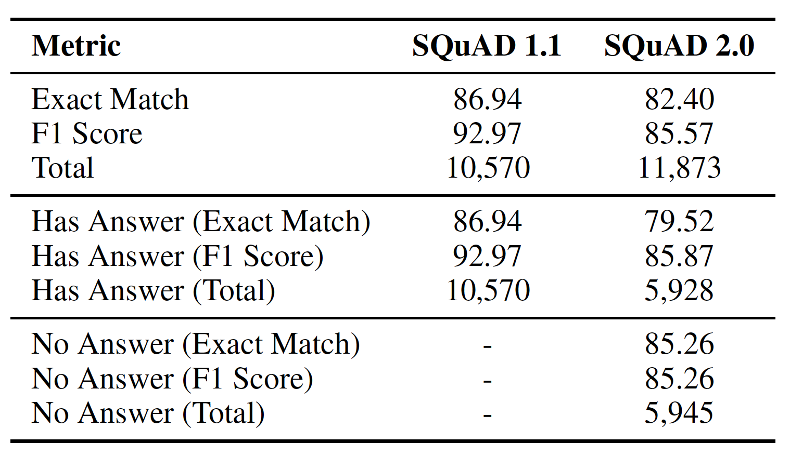

This project aims to develop an efficient Extractive QA system using the Retrospective Reader model, focusing on improving accuracy and real-time performance for tasks like search engines and virtual assistants. It will be evaluated on benchmark datasets like SQuAD 2.0 to ensure effectiveness with both answerable and unanswerable questions.




# User Guide

## Requirements

1. Install the required packages:
   ```
   pip install -r requirements.txt
   ```

## Training the Model

The model was trained on H100-96 GPUs on the SoC cluster. The training time was:

- Squad-v1.1: 60 minutes
- Squad-v2.0: 90 minutes

Notes:

1. If the model is trained on Squad-v2.0, it can handle both answerable and unanswerable questions.
2. If running on the SoC cluster, add the `srun` prefix.
3. The best hyperparameters are already configured:
   - Epochs: 2
   - Learning rate: 2e-5

### Training Squad-v1.1

```
python model.py --train --save_path "retro_reader_model.pth" --epochs 2 --lr 2e-5 --dataset "squad"
```

### Training Squad-v2.0

```
python model.py --train --save_path "retro_reader_model.pth" --epochs 1 --lr 2e-5 --dataset "squad_v2"
```

## Testing the Model

The testing process will generate a `predictions.json` file, which can be evaluated using the evaluation script.

### Testing Squad-v1.1

```
python model.py --test --model_path "retro_reader_model.pth" --dataset "squad"
```

### Testing Squad-v2.0

```
python model.py --test --model_path "retro_reader_model.pth" --dataset "squad_v2"
```

## Making Inferences

The inference process will generate an answer given a question and context.

### Inference on Squad-v1.1

```
python model.py --inference --question "What is the Capital of France?" --context "Paris is the capital of France, it has many great architectures including the Eiffel tower" --model_path "retro_reader_model.pth" --dataset "squad"
```

### Inference on Squad-v2.0

```
python model.py --inference --question "What is the Capital of France?" --context "Paris is the capital of France, it has many great architectures including the Eiffel tower" --model_path "retro_reader_model.pth" --dataset "squad_v2"
```

## Evaluating the Model

1. Generate the `predictions.json` file (this can be done using the test functionality of the `model.py` script).
2. Evaluate the model using the evaluation script.

### Evaluating Squad-v1.1

```
python evaluate-v2.0.py dev-v1.1.json predictions.json
```

### Evaluating Squad-v2.0

```
python evaluate-v2.0.py dev-v2.0.json predictions.json
```
